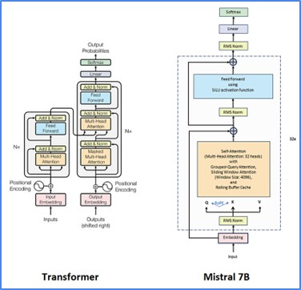
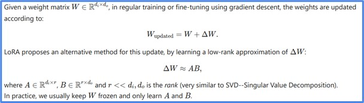
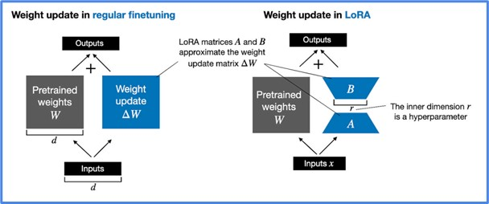

# PersonalChatbot
## Whatsapp based personal chatbot

# Background
This project is designed to create a personalized WhatsApp chatbot that mimics the user’s tone and communication style. By fine-tuning a Hebrew-optimized model on personal chat data, 
we developed a chatbot capable of replicating conversational nuances, such as tone, word choice, and even emoji usage. Below, we detail the methods used, including LoRA and QLoRA.

## Base Model and Architecture
The project uses the Mistral-7B model, a large language model built on the Transformer architecture and optimized for Hebrew. Mistral-7B includes 32 Transformer layers, each with advanced mechanisms for memory management and sequence handling, 
making it well-suited for personalized conversational applications. This model’s complex architecture enables it to manage context and nuance across longer conversations, which is crucial for producing a chatbot that "sounds" like the user.
 

## Data Preprocessing
To train the model on WhatsApp conversations, we first extracted chat data, removing irrelevant content like links, images, and voice memos. A Python script then structured the cleaned data into a template, 
marking conversational turns to help the model learn interaction dynamics. This setup helped the chatbot understand individual speaking styles and respond in a personalized manner.

## LoRA (Low-Rank Adaptation)
LoRA is a technique for fine-tuning large language models efficiently by reducing the number of trainable parameters. It does this by adding low-rank matrices to the model’s weight matrices during training, 
allowing the model to learn task-specific patterns with significantly fewer resources. For our chatbot, LoRA reduced the number of parameters needed for training to around 1.13% of the original model size, 
making fine-tuning possible on limited hardware without compromising quality.
 

 

## QLoRA (Quantized Low-Rank Adaptation)
QLoRA is an extension of LoRA that further optimizes resource usage through quantization. Quantization lowers the precision of the model’s weights, which reduces memory requirements and speeds up processing. 
In this project, we used 4-bit quantization, reducing the memory footprint substantially while still retaining the model’s conversational accuracy. 
QLoRA allowed us to deploy the chatbot with high efficiency, enabling it to run on smaller, more accessible hardware.

## Project Outcome
This project demonstrates the potential of customizing large language models for highly specific use cases. By combining techniques such as LoRA and QLoRA, 
we achieved a resource-efficient and responsive chatbot that can carry on conversations in the user’s own style. 
This approach opens possibilities for building personalized bots that can manage messaging platforms, provide reminders, and summarize important communications.

# Instructions
  1. Clone this repository to your machine.
  2. Make sure you have all the required libraries and versions that appear in the requirements.txt file.
  3. Export desired conversation from Whatsapp and extract the text file. Name it "WhatsappChatOriginal.txt" (without the quotations), and place it in the "PersonalChatbot/src/data_preprocessing" directory.
  4. Fill in the folowing template with your desired model if different from the default, 
     the full path to where you are storing your data  
     (path must end with PersonalChatbot/src/data_prepocessing/final_outputs/formatted_data.jsonl), 
     and the chosen path to where you want to save the final model: 
 
 
      ################################################### 
      ################## Fill This In ######################## 
      base_model_id = "yam-peleg/Hebrew-Mistral-7B" 
      path_to_data = "full/path/to/PersonalChatbot/src/data_prepocessing/final_outputs/formatted_data.jsonl" 
      saved_model_path = "path/to/save/model" 
      ################################################### 
      ################################################### 
 
 
     copy and paste this to the following 3 files in this project to replace the empty ones that are in the files by default:
       <ul>a. PersonalChatbot/src/chat/chat_bot.py</ul>
       <ul>b. PersonalChatbot/src/data_preprocessing/load_whatsapp.py</ul>
       <ul>c. PersonalChatbot/src/training/fine_tuning_model.py</ul>

  6. Change directory to PersonalChatbot/src/data_processing and run: python3 preprocess_start.sh
     <ul>Your processed data should appear in a final_outputs folder and should be called formatted_data.jsonl</ul>
  7. Change directory to PersonalChatbot/src/training
     <ul>run the following commant: python3 fine_tuning_model.py</ul>
     <ul>This can take a while and the duration depends on the amount of data in your Whatsapp chat.</ul>
  8. When step 6 is complete change directory to PersonalChatbot/src/chat</ul>
     <ul>run the following command: python3 chat_bot.py</ul>
     <ul>This will create a file named conversation.txt where your conversation with the model will appear. Type your input into the terminal and see the responses in the file conversation.txt</ul>
